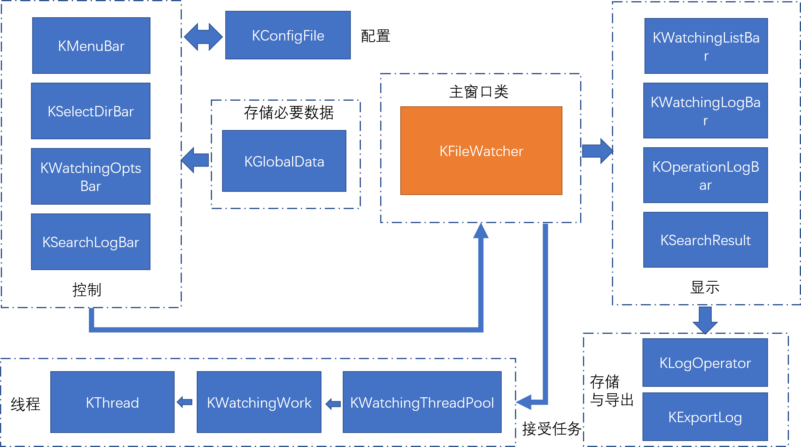
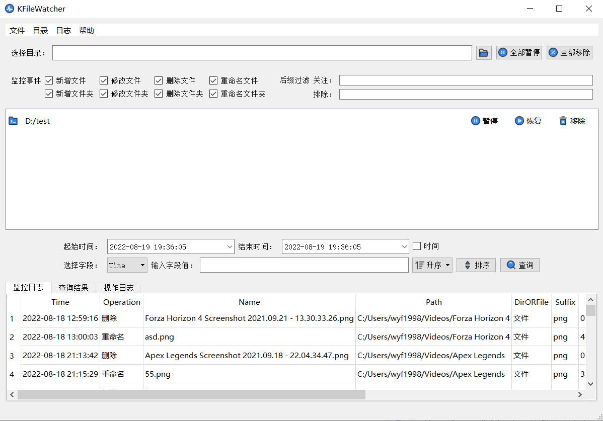
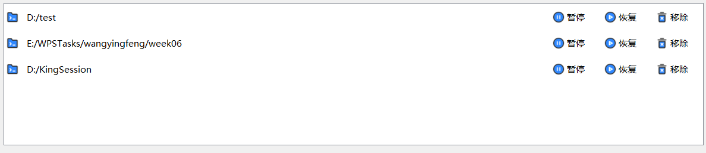

# FileWatcher
用于监视目录下文件/夹的更改（新增、删除、重命名、修改等），支持同时监控多个目录，支持监控日志保存到数据库文件，并提供查询、排序功能。

## 一、总体架构

- 总体架构

  **程序总体架构的设计主要可以分为：**

  - 主窗口类：整合各模块的操作，连接信号、处理事件
  - 控制模块：接收用户操作的各种控件，包含菜单栏、选择监控目录的控件类、监控事件选项、查询选项；
  - 显示模块：用于显示给用户的反馈信息以及监视器得到的消息日志
  - 全局数据类：存储控制组件的必要数据
  - 配置：配置文件的保存和加载
  - 线程模块：执行监控任务，线程的启动、暂停、删除统一由线程池管理
  - 存储与导出：监控日志存入数据库，并提供导出表格文件的选项

  **文件监视器总体架构图**

  

  文件监视器总体架构

## 二、程序功能与设计亮点

- 程序功能
  - 监控指定目录下文件和文件夹的新增、删除、修改、重命名，可同时监听多个目录（包括子目录）
  - 可以设置需要的监控事件
  - 可以暂停、恢复和移除指定监控目录，以及暂停、恢复和移除全部监控目录
  - 可以添加忽略和关注的文件后缀列表
  - 监控消息日志默认存储在数据库文件，用户可选择导出为excel文件
  - 用户可查询监控日志，根据时间、监控消息的字段值查询，并支持升序和降序排序
  - 程序退出时保留用户的配置文件，下次打开自动加载上一次的配置，包括监控目录
  - 可最小化托盘，监听到文件变化时有消息提示
- **设计亮点**
  - 线程执行函数来自`Win32` 函数 `ReadDirectoryChangesW` ，为了方便对线程的暂停和恢复，本项目重写了线程类，使用**互斥锁和条件变量实现了线程暂停、恢复和停止的接口**，线程暂停时不占用CPU资源；
  - 为了方便管理监控线程，**本项目设计了一个线程管理类（线程池）统一管理执行监控任务的工作线程，使用Map将监控目录与对应的监控线程一一对应**，方便利用信号与槽控制线程的暂停、恢复；
  - 监控日志存储在本地`sqlite`数据库文件，**利用`QSqlTableModel`管理日志消息的插入，查询，并绑定到`QTableView`实时显示给用户，并支持导出为excel表格文件**；
  - 使用到了常用的设计模式之一--**单例模式**，其中全局数据类`KGlobalData`为懒汉单例模式，添加了互斥锁保证线程安全，日志操作类`KLogOperator`类为饿汉式单例模式，两种单例模式均实现了**自动资源回收**，确保不出现内存泄漏；
  - 程序的监控事件、过滤后缀列表、监控目录等选项信息保存在配置文件中，无需用户手动保存和加载，**程序打开和关闭时自动加载和保存配置文件**；
  - **监控目录实时显示当前状态（根据图标的变化显示是暂停还是监控中）**，提供按钮和右键菜单选项暂停、恢复和移除选中的监控目录项
  - 对主界面重要按钮与选项进行了美化，提高了可用性与辨识度
  - **本项目内存占用较小，即使同时监控多个目录，内存使用不超过30Mb**

程序主界面



## 三、重要模块的实现思路与原理

- **主窗口类**，该类负责整个程序的调度，连接各对象成员的信号槽，类的声明如下

  ```C++
  class KFileWatcher : public QMainWindow
  {
      Q_OBJECT
  
  public:
      KFileWatcher(QWidget *parent = Q_NULLPTR);
      ~KFileWatcher();
  
      void initWindow();          //初始化窗口
      void initConnection();      //初始化信号槽连接
      void searchLogFromDb();     //从数据库查询日志
      void sortLogByField();      //根据字段排序
      void exportLogToExcel();    //导出excel文件
      void showAboutInfo();   //显示关于信息
  
      void createWatchingWork(const QString& dir);   //执行监控的槽
  
      virtual void closeEvent(QCloseEvent* event) override;   //窗口关闭事件拦截，进入系统托盘
  
  private:
      Ui::KFileWatcherClass ui;
  
      /*主界面组件*/
      KMenuBar* m_pMenuBar;
      KSelectDirBar* m_pSelectDirBar;
      KWatchingOptsBar* m_pWatchingOptsBar;
      KWatchingFillterBar* m_pWatchingFillterBar;
      KWatchingListBar* m_pWatchingListBar;
      KSearchLogBar* m_pSearchLogBar;
      KWatchingLogBar* m_pWatchingLogBar;
      KSearchResult* m_pSearchResult;
      KOperationLogBar* m_pOperationLogBar;
      QTabWidget* m_pLogTabWidget;
  
      /*布局*/
      QHBoxLayout* m_pHLayout;    //水平布局
      QVBoxLayout* m_pVLayout;    //垂直布局
  
      KWatchingThreadPool* m_pWatchingThreadPool;	//线程池
      KLogExport* m_pLogExport;	//导出操作句柄
  };
  
  ```

- **控制模块**，接收用户操作的各种控件，包含菜单栏、选择监控目录的控件类、监控事件选项、查询选项；

  - **首先比较关键的是选中监控目录的控制组件以及全部暂停/恢复和移除按钮，主要实现在`KSelectDirBar`类**，类的声明如下：

  ```C++
  class KSelectDirBar : public QWidget
  {
  	Q_OBJECT
  public:
  	KSelectDirBar(QWidget* parent);
  	~KSelectDirBar();
  	void initFileDialog();	//初始化文件对话框
  	QStringList getDirFileNames();
  signals:
  	void startWatch();	//开始监控信号
  	void pauseWatch();	//全部暂停信号
  	void resumeWatch();	//全部恢复信号
  	void removeWatch();	//全部移除信号
  public slots:
  	void showDirName();
  	void checkDirName();
  	void emitPauseResumeSignal();
  	void emitRemoveSignal();
  private:
  	QHBoxLayout* m_pHLayout;
  	QLabel* m_pSelectLabel;
  	QLineEdit* m_pDirShow;
  	QFileDialog* m_pFileDialog;
  	QPushButton* m_pBtnSelect;
  	QStringList m_dirFileNames;
  	QPushButton* m_pBtnPause;
  	QPushButton* m_pBtnRemove;
  	bool m_isPause;
  };
  ```

  `KSelectDirBar`实现了两种方式选择监控目录：**文本框输入和按钮打卡对话框选择**，其中文本框输入需要判断输入是否有效，两者都需要检查是否重复选择；此处的全部暂停和全部恢复按钮统一为一个按钮，通过增加标志位判断状态，发生不同的信号以及改变图标，关键代码如下：

  ```C++
  void KSelectDirBar::emitPauseResumeSignal()
  {
  	if (!m_isPause)
  	{
  		emit pauseWatch();
  		m_isPause = true;
  		m_pBtnPause->setIcon(QPixmap(":/KFileWatcher/icons/play.svg"));
  		m_pBtnPause->setText(QStringLiteral("全部恢复"));
  	}
  	else
  	{
  		emit resumeWatch();
  		m_isPause = false;
  		m_pBtnPause->setIcon(QPixmap(":/KFileWatcher/icons/pause.svg"));
  		m_pBtnPause->setText(QStringLiteral("全部暂停"));
  	}
  }
  ```

- **显示模块**：用于显示给用户的反馈信息以及监视器得到的消息日志

  显示模块比较重要且复杂的是**显示监控列表的窗口**，**该控件既能显示又能控制**，肩负显示的责任，也需要复杂控制监控列表项对应的线程,如图所示；

  

  本项目设计了`KWatchingListBar`类，该类继承自`QListWidget`，类的声明如下：

  ```C++
  class KWatchingListBar : public QListWidget
  {
  	Q_OBJECT
  
  public:
  	KWatchingListBar(QWidget* parent = nullptr);
  	~KWatchingListBar();
  
  	void initWatchingListBar();
  	void onCustomContextMenuRequested(const QPoint& pos);
  
  signals:
  	void pauseWorkByItem(const QString& dir);
  	void resumeWorkByItem(const QString& dir);
  	void removeWorkByItem(const QString& dir);
  	
  public slots:
  	void updateWatchingListBar(const QString& dir);
  	void setSelectedItem(QListWidgetItem* item);
  	void setWatchingItemIconOk();
  	void setWatchingItemIconPause();
  	void setWatchingItemIconOkAll();
  	void setWatchingItemIconPauseAll();
  	void removeWatchingItemFromBarAll();
  	void removeWactchingItemFromBar();
  	void removeWatchingItemByRightKey();
  
  private:
  	QMap<QListWidgetItem*, KListItemWidget*>* m_pWatchingList;	//保存监控目录对应的列表项
  	QListWidgetItem* m_pSelectedItem;	//选中的列表项
  	QString m_pSelectedItemDir;			//选中列表项的目录
  
  	QMenu* m_pContextMenu;		//右键菜单
  	QAction* m_pPauseAction;	//暂停
  	QAction* m_pResumeAction;	//恢复
  	QAction* m_pRemoveAction;	//移除
  };
  ```

  `QListWidgetItem`类想要存放用于控制的按钮，需要提供`ItemWidget`，于是自定义了`KListItemWidget`类用于布局按钮；实现列表选中控制暂停恢复的连接初始化如下：

  ```C++
  void KWatchingListBar::setSelectedItem(QListWidgetItem* item)
  {
  	m_pSelectedItem = item;
  	m_pSelectedItemDir = m_pWatchingList->find(item).value()->getItemDir();
  
  	//与列表项中的暂停按钮连接，并发送暂停信号(通过KWatchingListBar)
  	connect(m_pWatchingList->find(m_pSelectedItem).value()->m_pBtnPause, &QPushButton::clicked
  		, this
  		, [this]()
  		{emit pauseWorkByItem(m_pSelectedItemDir); }
  	);
  
  	//与列表项中的暂停按钮连接，改变item图标为挂起
  	connect(m_pWatchingList->find(m_pSelectedItem).value()->m_pBtnPause, &QPushButton::clicked
  		, this
  		, &KWatchingListBar::setWatchingItemIconPause);
  
  	//与列表项中的恢复按钮连接，并发送恢复信号(通过KWatchingListBar)
  	connect(m_pWatchingList->find(m_pSelectedItem).value()->m_pBtnResume, &QPushButton::clicked
  		, this
  		, [this]()
  		{emit resumeWorkByItem(m_pSelectedItemDir); }
  	);
  
  	//与列表项中的恢复按钮连接，改变item图标为恢复监控
  	connect(m_pWatchingList->find(m_pSelectedItem).value()->m_pBtnResume, &QPushButton::clicked
  		, this
  		, &KWatchingListBar::setWatchingItemIconOk);
  
  	//与列表项中的移除按钮连接，发送移除当前监控目录信号
  	connect(m_pWatchingList->find(m_pSelectedItem).value()->m_pBtnDelete, &QPushButton::clicked
  		, this
  		, &KWatchingListBar::removeWactchingItemFromBar);
  
  	//右键菜单信号连接
  	connect(m_pPauseAction, &QAction::triggered, this, [this]()
  		{emit pauseWorkByItem(m_pSelectedItemDir);}
  	);
  	connect(m_pPauseAction, &QAction::triggered, this, &KWatchingListBar::setWatchingItemIconPause);
  
  	connect(m_pResumeAction, &QAction::triggered, this, [this]()
  		{emit resumeWorkByItem(m_pSelectedItemDir); }
  	);
  	connect(m_pResumeAction, &QAction::triggered, this, &KWatchingListBar::setWatchingItemIconOk);
  
  	connect(m_pRemoveAction, &QAction::triggered, this, &KWatchingListBar::removeWatchingItemByRightKey);
  }
  ```

- **配置模块**：配置文件是用来保存用户对控制组件的更改信息，用于下一次打卡程序时恢复上一次的操作，本项目配置模块主要包含`KConfigFile`类和相关的保存和加载配置函数；

  - `KConfigFile`使用Qt的`QSettings`类管理配置文件的读写，类的声明如下：

    ```C++
    class KConfigFile : public QObject
    {
    public:
    	KConfigFile(QString fileName, QObject* parent = nullptr);
    	~KConfigFile();
    
    	QString getConfigFileName();
    	/*写配置*/
    	void setConfig(const QString& nodeName, const QString& keyName, const QString& valueName);
    	/*读配置*/
    	//单个value
    	QVariant getConfig(const QString& nodeName, const QString& keyName, const QVariant& defaultValue);
    	//一个节点下的所有value
    	QStringList getConfigNode(const QString& nodeName);
    	//删除配置
    	void removeAllConfig();
    private:
    	QString m_configFileName;	//文件名
    	QSettings* m_pConfigSettings;
    };
    ```

  - 保存和加载配置文件的函数分别放在`KGlobalData`的析构和构造中，`saveConfigFile()`和`loadConfigFile()`和函数实现如下：

    ```C++
    void KGlobalData::saveConfigFile()
    {
    	//写入监听事件配置
    	m_pConfiger->setConfig("EVENTSOPTS", "bitset",
    		QString::fromStdString(m_eventsOpts.to_string<char, std::string::traits_type, std::string::allocator_type>()));
    
    	//写入监听列表
    	if (!m_pWatchingList->isEmpty())
    	{
    		int i = 0;
    		for (QStringList::iterator it = m_pWatchingList->begin(); it != m_pWatchingList->end(); ++it, ++i)
    		{
    			m_pConfiger->setConfig("WATCHINGLIST", QString("dir%1").arg(i), *it);
    		}
    	}
    	
    	//写入关注和过滤列表
    	if (!m_includeSuffixs.isEmpty())	//关注后缀列表
    	{
    		QString insuffixs = m_includeSuffixs.join(",");
    		m_pConfiger->setConfig("SUFFIXSFILLTER", "includesuffixs", insuffixs);
    	}
    
    	if (!m_excludeSuffixs.isEmpty())		//排除后缀列表
    	{
    		QString exsuffixs = m_excludeSuffixs.join(",");
    		m_pConfiger->setConfig("SUFFIXSFILLTER", "excludesuffixs", exsuffixs);
    	}
    }
    
    void KGlobalData::loadConfigFile()
    {
    	//读入监听事件配置
    	std::string bitsetStr = m_pConfiger->getConfig("EVENTSOPTS", "bitset", "11111111").toString().toStdString();
    	m_eventsOpts = std::bitset<8>(bitsetStr);
    
    	//读入监听列表
    	*m_pWatchingList = m_pConfiger->getConfigNode("WATCHINGLIST");
    	
    	//读入关注和过滤列表
    	m_includeSuffixs = m_pConfiger->getConfig("SUFFIXSFILLTER", "includesuffixs", "").toString().split(",");
    	m_excludeSuffixs = m_pConfiger->getConfig("SUFFIXSFILLTER", "excludesuffixs", "").toString().split(",");
    }
    ```

- **线程模块：**执行监控任务，线程的启动、暂停、删除统一由线程池管理

  - 重写的线程类，实现了线程暂停、恢复和停止接口

    ```C++
    class KThread : public QThread
    {
    	Q_OBJECT
    
    public:
    	KThread(QObject* parent = nullptr);
    	~KThread()override;
    
    	enum class State
    	{
    		Stoped,
    		Running,
    		Paused
    	};
    
    	KThread::State threadState()const;
    public slots:
    	void start(Priority pri = InheritPriority);
    	void stop();
    	void pause();
    	void resume();
    
    protected:
    	virtual void run()final;
    	virtual void process() = 0;		//子类重写此函数为工作函数	
    	std::atomic_bool m_pauseFlag;	//使用原子类型保证安全
    	std::atomic_bool m_stopFlag;
    	QMutex m_qMutex;
    	QWaitCondition m_qCondition;
    };
    ```

  - 继承自自定义线程类的工作任务类，重写process函数为监控函数

    ```C++
    class KWatchingWork : public KThread
    {
    	Q_OBJECT
    
    public:
    	KWatchingWork(const QString& watchingDir, QObject* parent = nullptr);
    	~KWatchingWork() override;
    
    	virtual void process() override;
    
    	void packetAndInsertLog(		//打包监控消息日志并根据过滤规则插入进数据库
    		QString& dir
    		, const QString& currentName
    		, const QString& oldName
    		, const QString& operation
    	);
    
    public slots:
    	void pauseCurrentWork(const QString& dir);
    	void resumeCurrentWork(const QString& dir);
    	void stopCurrentWork(const QString& dir);
    	void setEventsOpts(std::bitset<8> opts);
    
    private:
    	QString m_watchingDir;
    	std::bitset<8> m_eventsOpts;	//位集合表示某一事件是否监听
    };
    ```

  - 线程池类，负责线程的创建和回收，在有监控目录添加时创建线程，并存入map，**接收来自主线程其他类对象的信号并转发给正在工作的子线程让其执行暂停、恢复或停止操作；**

    ```
    class KWatchingThreadPool : public QObject
    {
    	Q_OBJECT
    
    public:
    	KWatchingThreadPool(QObject* parent);
    	~KWatchingThreadPool();
    
    	void initWatchingFromCfg();
    	void addWatchingWork(const QString& watchingDir);
    	void startWatchingWork();
    
    	void emitPauseToThread(const QString& dir);
    	void emitResumeToThread(const QString& dir);
    	void emitStopToThread(const QString& dir);
    
    	void pauseAllWork();
    	void resumeAllWork();
    	void removeAllWork();
    	void removeWork(const QString& dir);
    
    signals:
    	void pauseWork(const QString& dir);
    	void resumeWork(const QString& dir);
    	void stopWork(const QString& dir);
    
    private:
    	//将监控目录与执行监控线程用键值对存起来，方便查找和管理
    	QMap<QString, KWatchingWork*>* m_pThreadPool;	
    };
    ```

**补充：**代码打包之后出现了bug，程序在其他电脑上运行无法创建数据库，经排查是创建数据库时，一方面未加载`plugins`下的动态库；另一方面创建数据库必须在`QApplication a(argc, argv)`之后，此项目数据库操作的类`KLogOperator`起初使用饿汉式单例模式，先完成对象创建，debug模式下正常，release之后无法创建数据库，在更改为懒汉式单例模式之后解决了该问题。